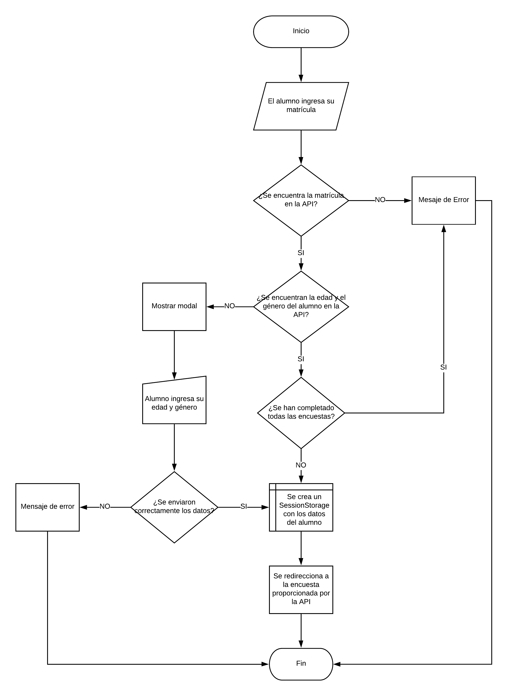
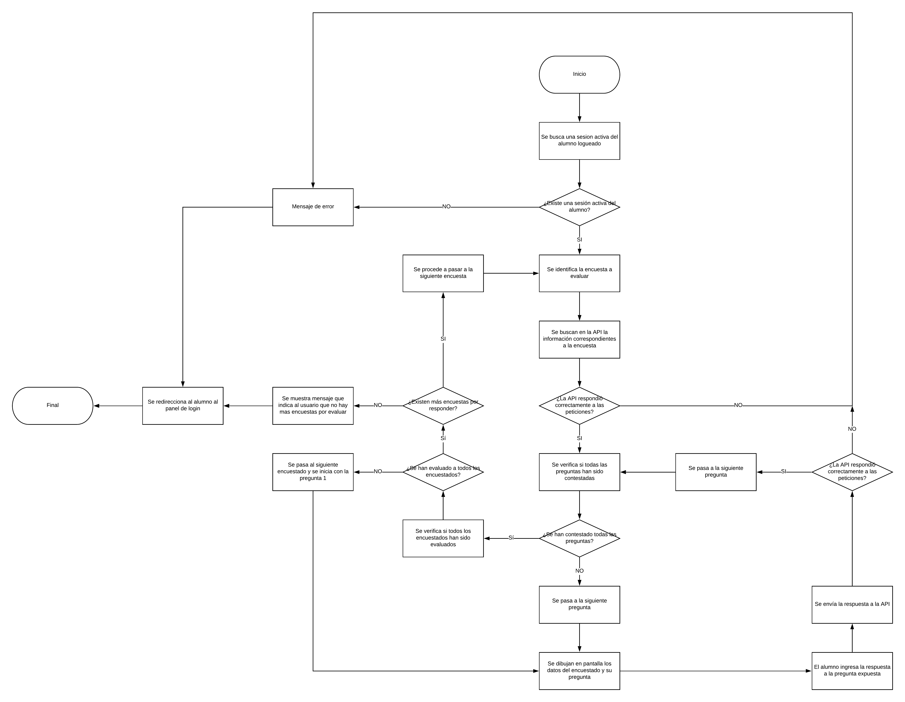

# APEVAD

Aplicación web que permite a los alumnos de la Universidad Alva Edison evaluar el desempeño académico y laboral a Docentes y Administrativos durante el transcurso de un semestre. Por otro lado, permite a los administrativos encargados de la evaluación conocer, mediante gráficas, el desempeño de lo Docentes y Administrativos. 

Está constituido por tres partes esenciales:

  - APEVAD API
  - APEVAD Alumno
  - APEVAD Administrativo

# APEVAD Alumno

Aplicación de cara al alumno que le permite ingresar con su matrícula a la evaluación de:

  - Docentes
  - Administrativos
  - Encuesta de Satisfacción

# Diagrama de Login

# Diagrama de Cuestionario

Puntos a tomar en cuenta:

  - La encuesta en la V1 son: administrativos, docentes y satisfacción
  - La información de encuesta lleva:
    - Información de encuestados: Todos los encuestados de una encuesta
    - Información de preguntas: Todas las preguntas de una encuesta
    - Información de último encuestado: El ID del último encuestado evaluado - El ID de la última pregunta contestada
  - Para obtener la información de encuesta se deben de hacer 3 peticiones a la API para obtener los datos, correspondiendo a cada información de encuesta expuesta arriba. Cada petición debe de llevar la URI correspondiente y el token válido del alumno

Para extrapolar el diagrama de abajo con la programación, se debe entender que la API entrega la mayoría de los casos un array de objetos en formato JSON, por lo que el ID de un encuestado y el ID de una pregunta no indican la posición que ocupan en el JSON. Por lo tanto, se debe buscar la fila a la que pertenece el ID del encuestado y/o pregunta, pero no se debe de olvidar guardar en una variable el ID de los mismos para enviar la respuesta, ya que la URI que recibe la API debe contener el ID correcto para poder procesarla correctamente.

<<<<<<< HEAD

# Plugins Externos

| Plugin | README |
| ------ | ------ |
| Bootstrap | https://getbootstrap.com/ |
| JQuery | https://jquery.com/ |
| Material | https://daemonite.github.io/material/ |
| Popper | https://popper.js.org/ |
<<<<<<< HEAD
| Sweet Alert | https://sweetalert2.github.io/ |
=======
| Sweet Alert | https://sweetalert2.github.io/ |
